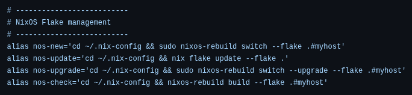

# My NixOS Configuration


This repository contains my NixOS system and home-manager configuration, managed declaratively using flakes. It supports modular setups for hosts, desktops, packages, and user environments.

## Quick Start

1. **Clone the repository** to your home folder:

```bash
git clone https://github.com/querzion/.nix-config && cd ~/.nix-config
```
2. Use this flake to rebuild your system and home-manager 
(forces Nix to use these files instead of /etc/nixos/configuration.nix):
- first time!
```bash
sudo nixos-rebuild switch --flake ~/.nix-config#myhost
```
- second time, and onwards
```bash
nos-new
```
Here's the flake commands that are in the bashrc.nix file (home/querzion/bashrc.nix)


That's it — your system will now use the configurations from this repository.

Built with ❤️ using NixOS 25.05
